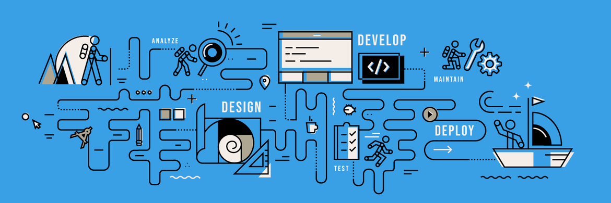

  

<h1 align="center">👋 Salut, Its me <strong>Souak Soufiyan</strong></h1>

  🎯 <strong>Développeur Full-Stack Web & Mobile</strong> 
  📍 Rabat, Maroc &nbsp;|&nbsp; 💼 JS/TS · PHP · Laravel · React · React Native 
  📧 <a href="mailto:souaksoufyen@gmail.com">souaksoufyen@gmail.com</a> &nbsp;|&nbsp; 🌐 <a href="https://s-soufyen.netlify.app/">s-soufyen.vercel.app</a>

  

---

## 🧠 À propos de moi

Passionné par la tech, je conçois des solutions digitales performantes, modernes et scalables depuis plus de **4 ans**.

- 💻 Stack quotidienne : **React.js**, **Next.js**, **Vue.js**, **Laravel**, **Node.js**, **Tailwind CSS**
- 🔐 Création d'**APIs REST** robustes, sécurisées et maintenables
- 📱 Développement **mobile-first** avec **React Native** + **Expo**
- 🔁 Intégration, CI/CD, automatisation, gestion d’état, tests
- 🚀 Toujours à l'affût des dernières évolutions tech & best practices

---

## 🚀 Stack technique & outils

### 🧩 Langages & Frameworks

 

---

### 🛠️ Outils de Développement

&nbsp;&nbsp;

---

### 🧪 Bases de données & APIs

 

---

### 🔄 Intégration & DevOps

---

## 📂 Projets en vedette

| Projet | Description | Stack | Statut |
|--------|-------------|-------|--------|
| **🔧 WorkFlow CRM/ERP** | Solution all-in-one de gestion d’entreprise (projets, automatisation, opérations, RH...) | Laravel · Bootstrap · jQuery · Charts.js | 🛠 Maintenance |
| **🍽 DishDash POS** | Système de point de vente pour restaurants : commandes, cuisine, livraison, tables interactives | Laravel · Vue 3 · Bootstrap 5 | 🚧 En cours |
| **🧗‍♂️ Ropeup** | Plateforme de réservation & gestion d’activités outdoor (escalade, randonnée...) | Next.js · Node.js · MongoDB | ✅ En ligne |
| **📋 Plateya** | SaaS pour Office Managers et freelances : gestion de tâches, documents et workflow | Laravel · Vue.js · MySQL | 🔒 Privé |
| **🚗 UCars Hub** | App mobile d’annonces auto avec localisation vendeurs et fiches détaillées | React Native · Expo · Supabase | ✅ En ligne |
| **🏠 Multilist** | Plateforme immobilière B2B/B2C avec intégration CRM et synchro d'annonces clients | Laravel · Vue.js · REST API | 🛠 Maintenance |
| **🛡 Digis Assur** | Application web d’assurance frontière pour véhicules à l’international | Laravel · Vue.js | ✅ En ligne |
| **📡 Telcoz Portail** | Portail pour experts en télécommunications, services & gestion technique | Laravel · Bootstrap | 🧪 Prototype |

🔎 Explorez davantage sur mon [📁 portfolio](https://souaksoufyen.vercel.app) ou mes [📂 projets GitHub](https://github.com/souaksoufiyan?tab=repositories)

---

## 🏆 Trophées GitHub

  

---

## 🤝 Travaillons ensemble !

Vous avez un projet, une idée, une mission freelance ?  
👉 Je suis prêt à collaborer sur des projets passionnants et impactants.

📩 Contact : [souaksoufyen@gmail.com](mailto:souaksoufyen@gmail.com)  
🌐 Portfolio : [https://souaksoufyen.vercel.app](https://souaksoufyen.vercel.app)  
📎 LinkedIn : [soufyensouak](https://www.linkedin.com/in/soufyensouak)

---

<em>Merci pour votre visite 🙌</em>

